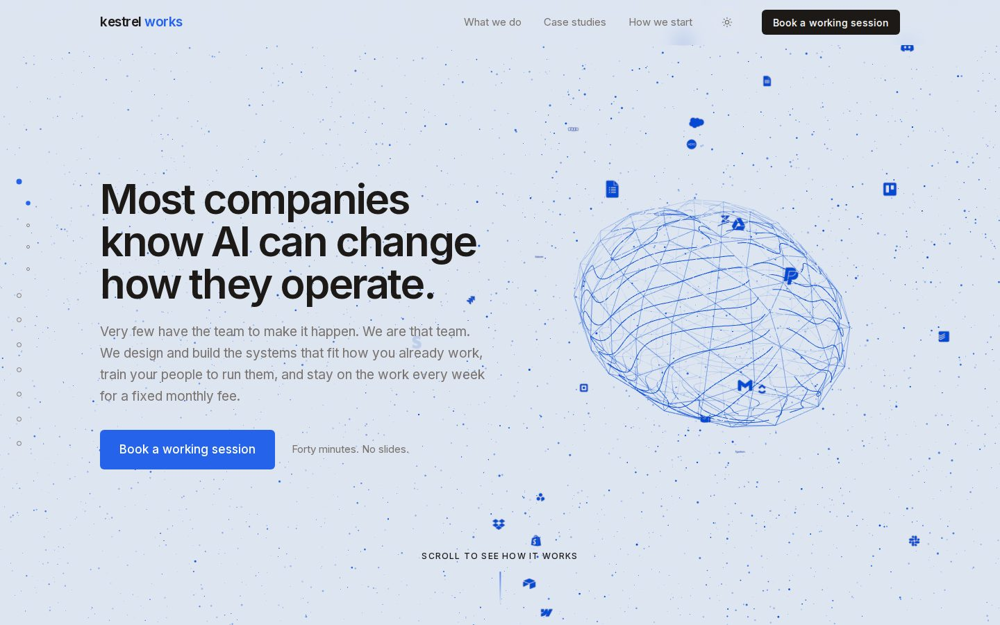
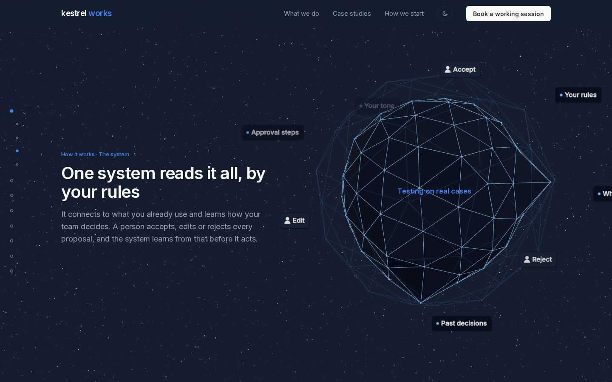
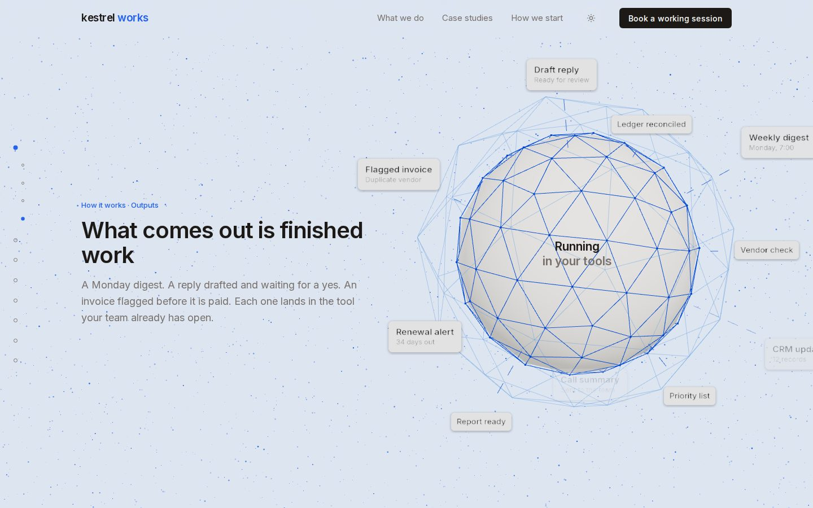
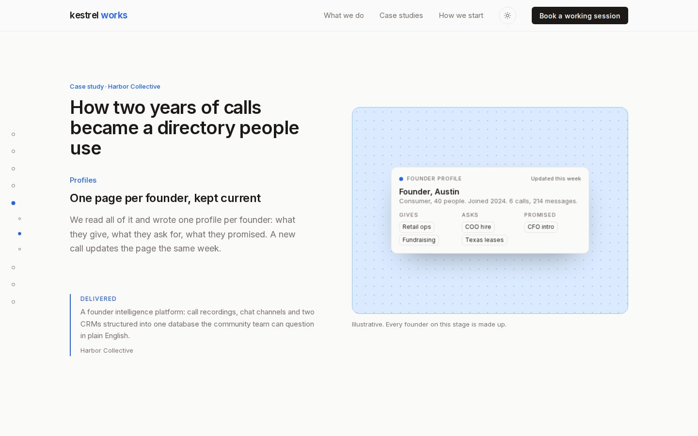
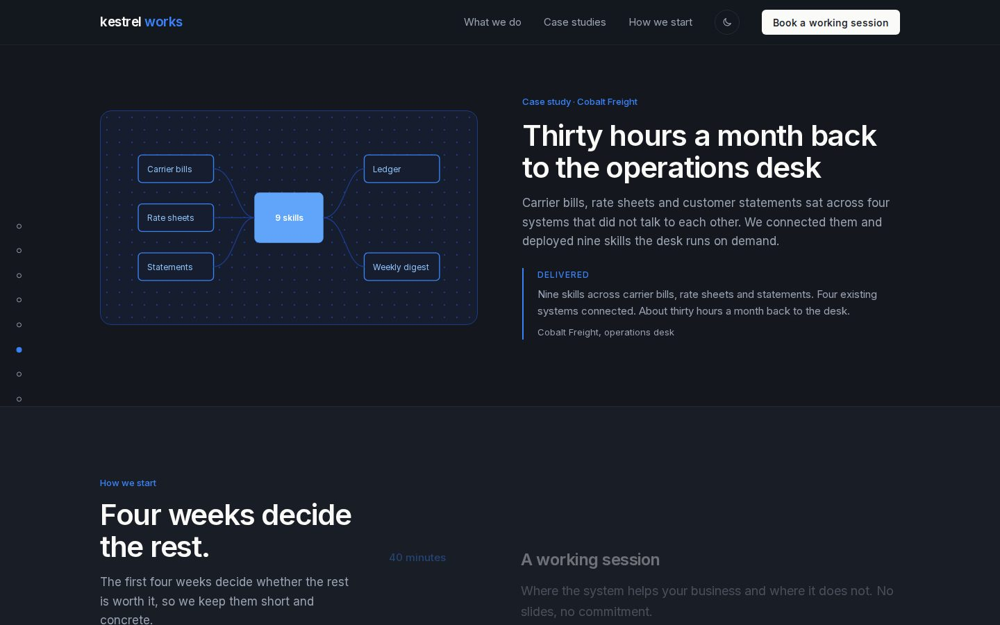
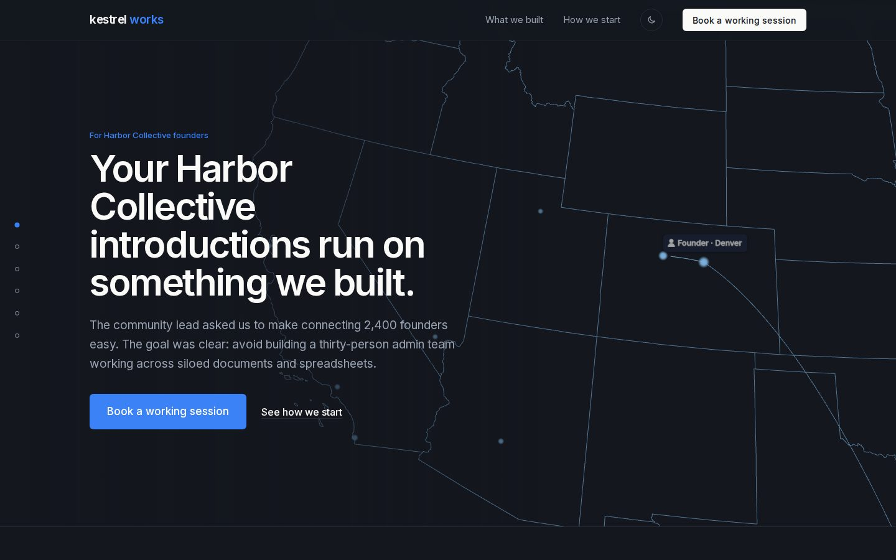
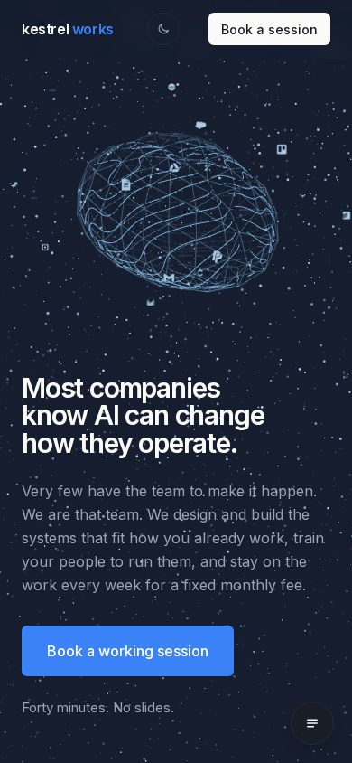
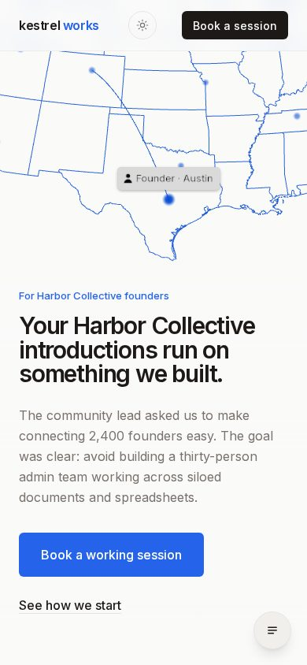
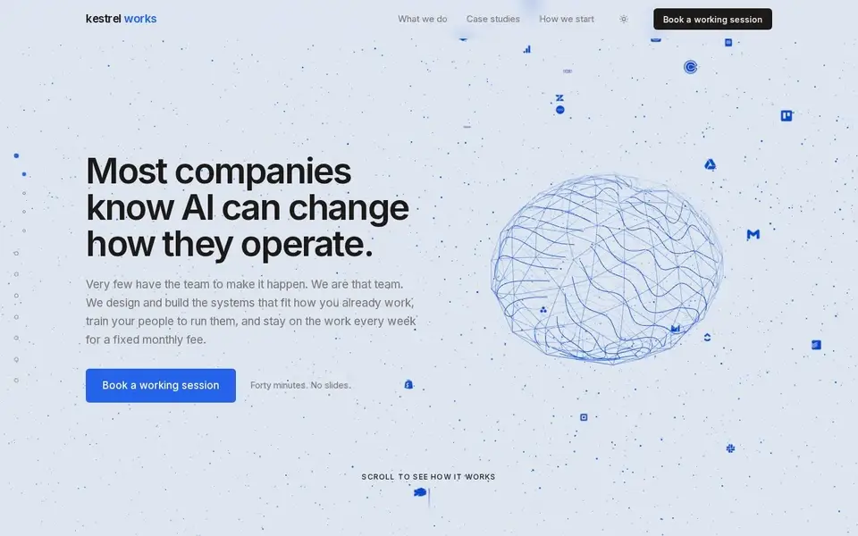
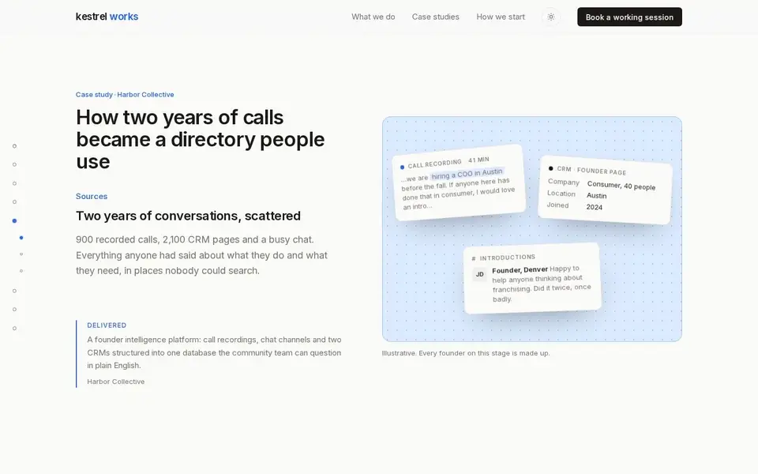

# Kestrel Works

A marketing site for a fictional operations studio, built to show a design system directed end to end: a scroll-driven
Three.js scene that opens the homepage, a travelling map behind a lead page, a page guide, light and dark themes, and the
performance work that makes all of it feel instant.

Every client, person and figure on these pages is fictional.








<p>
  
  
</p>

## In motion

Scroll drives the opening scene: the brain smooths into the orb, the sources connect, the core digests, the outputs travel out.



The map behind the lead page travels from one founder to the next on its own clock.


The case story is a pinned scene scrubbed by scroll, with the stage moving from scattered sources to a profile to signals.



## What is in it

- **The system scene** (`src/app/_home/system-scene.tsx`). A wireframe brain drawn with iso-lines of a folded stripe field
  that smooths into an orb as the reader scrolls, under a camera-space sky of 8,600 points. Tool marks drift loose through
  space and settle onto an orbit, sources converge, the core digests with human review, and outputs travel out along lanes.
  Scroll is the only timeline: the page writes `--p` and the scene reads it.
- **The travelling map** (`src/app/_home/map-scene.tsx`). The lower 48 as a blueprint, zoomed in. The view hops from one
  founder to the next in a chain, panning so the landing city sits to the right while the copy rests on the calmer side.
- **Stills at first paint** (`scripts/posters.mjs`). A WebP still of each scene sits under its canvas from the first paint
  and fades once the live scene has drawn. One per theme and per framing the scene distinguishes.
- **GPU warm-up.** Every material compiles and every texture uploads while the still is showing, so the first scroll never
  pays for it in one long frame.
- **A page guide** with sub-steps for the pinned scenes, URL hashes, and a section menu on phones.
- **Pinned case stories** scrubbed by scroll with paused CSS animations, no scroll-timeline support needed.
- **Light and dark**, following the device until the reader picks.

## Run it

```bash
npm install
npm run map        # builds public/us-outline.json from us-atlas (Albers, lower 48, 24 cities)
npm run dev
```

The stills under `public/posters` are committed. To regenerate them after changing a scene, build once, serve the build,
run the script against it, then build again so the server picks up the new files:

```bash
npm run build && npx next start -p 3011 &
npm run posters
npm run build
```

The script needs a Chromium binary. It looks for the Playwright headless shell by default; set `CHROME` to another path.

## Stack

Next.js 16 (App Router, Turbopack), React 19, Tailwind CSS 4, three.js with react-three-fiber and drei, simple-icons for
the tool marks, us-atlas and topojson-client for the map. Type is Inter.

## Credits

three.js, react-three-fiber and drei are MIT. us-atlas and topojson-client are ISC. simple-icons is CC0; the marks it
carries belong to their owners and appear here as the integrations a system like this reads from. Inter is under the SIL
Open Font License. The rest is MIT, see LICENSE.
